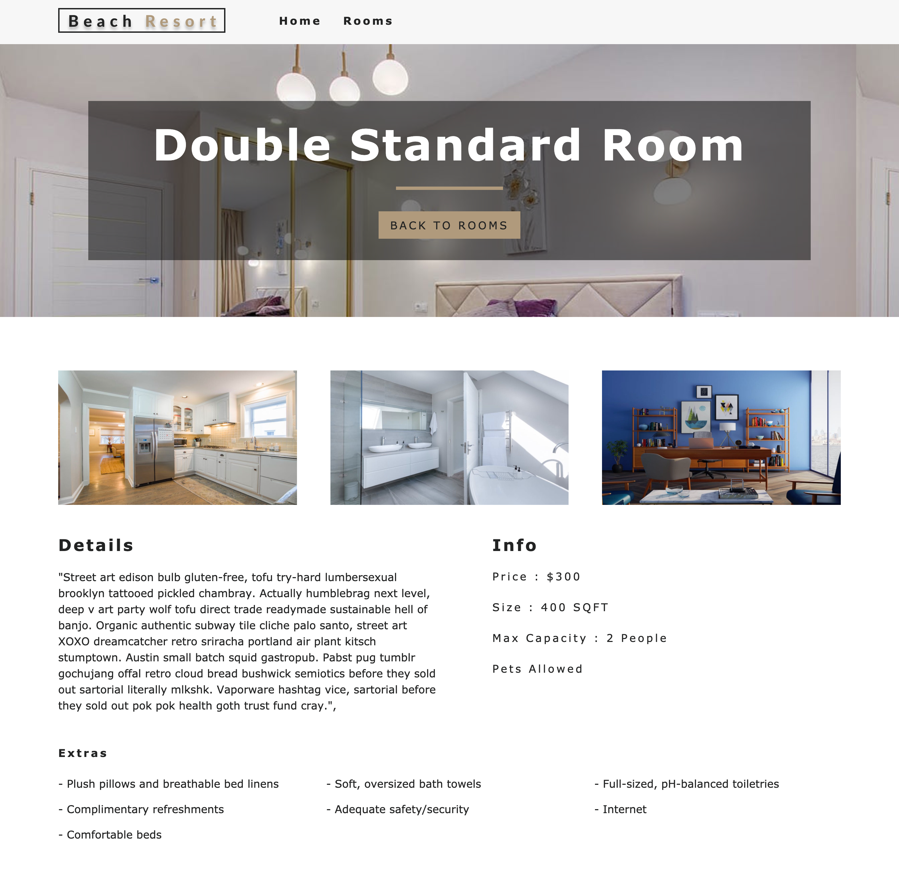

# Hotel Reservation - Beach resort Website

Check it out at https://beach-resort-reservation-react.netlify.app/

## Features

- React router for routing, React context API for state management, Contentful headless CMS(Contentful) for data management, and Netlify to host the application.
- Filtering rooms based on user's search criteria with filters for room type, number of guests, room price, room size, breakfast included, and pets allowed
- Responsive website design
- Appropriate error page
- Navigation to each room for details

### Tech Stack

- React, React Hook, React Context API, CSS, JavaScript

### Home Page

### Our Rooms Page

### Single room Page(One example)

